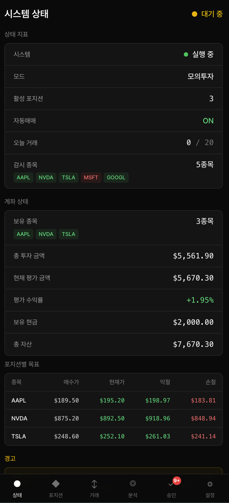
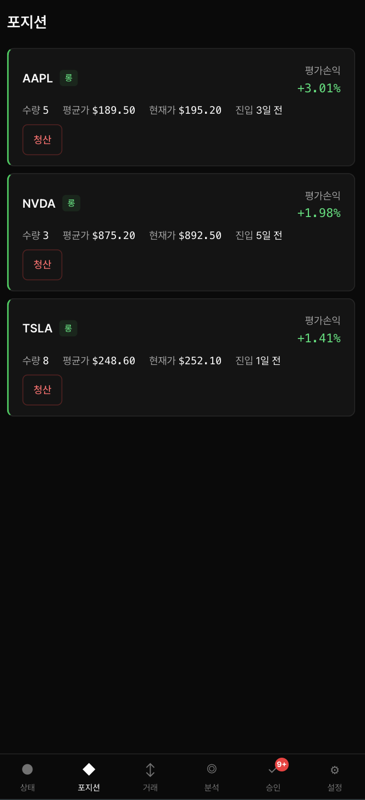
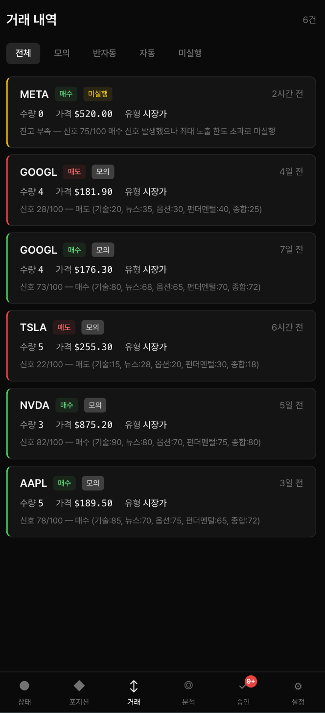
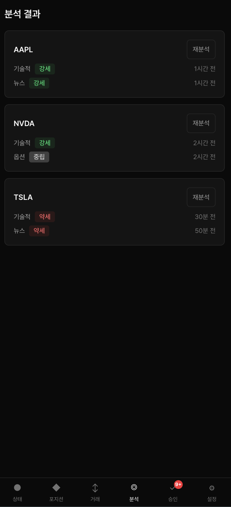
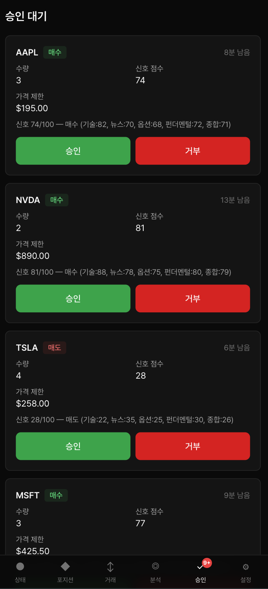
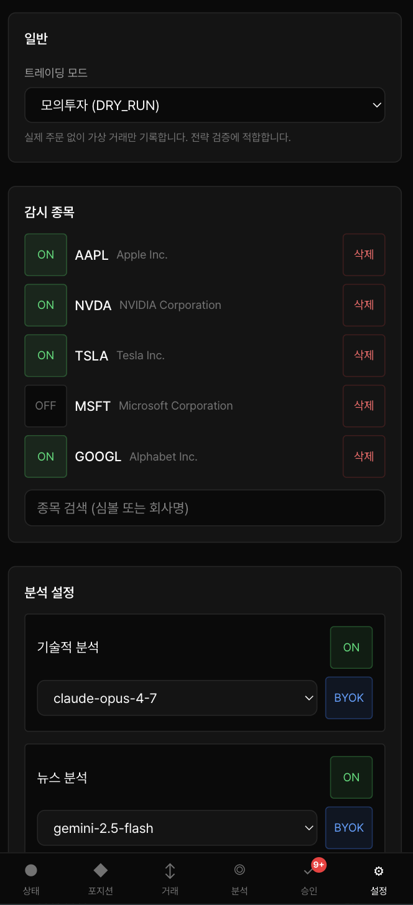

# siglens-trader

<div align="center">


## Siglens 분석 사이트 기반 작동

[](https://siglens.io)
[](https://github.com/y0ngha/siglens)


US 주식 자동매매 시스템. AI 분석 결과를 기반으로 매매 신호를 생성하고, 설정된 모드에 따라 자동으로 주문을 실행한다.

</div>

## 제품 화면

<p align="center">
  
  
  
  
  
  
</p>

## 문서

- [배포 가이드](docs/DEPLOYMENT.md)
- [보상 트랜잭션 설계](docs/COMPENSATING_TRANSACTIONS.md)

## 동작 원리

```
[FMP / Yahoo Finance]  →  가격·뉴스·옵션·펀더멘털 데이터 수집
         ↓
[siglens-core]         →  프롬프트 빌드 + 분석 요청 (submit/poll)
         ↓
[siglens-worker]       →  LLM 호출 (Claude, Gemini, GPT)
         ↓
[strategy 모듈]        →  분석 결과 점수화 → 매매 판단 (추가 매수/부분 매도 포함)
         ↓
[Toss Securities API]  →  주문 실행 (auto 모드일 때만, 멱등성 키 + 주문 추적)
         ↓
[reconcile cron]       →  미체결 주문 타임아웃 + DB 정합성 검사 (10분 간격)
```

### 분석 축

| 분석 | 데이터 소스 | 판단 근거 |
|------|------------|-----------|
| 기술적 분석 | FMP (가격/바) | 추세, 리스크 레벨, 지지/저항, 보조지표 시그널 |
| 뉴스 분석 | FMP (뉴스) | 시장 센티먼트, 이벤트 영향도 |
| 옵션 분석 | Yahoo Finance | Put/Call 비율, OI 변화, IV 분석 |
| 펀더멘털 분석 | FMP (재무제표) | 밸류에이션, 성장성, 재무건전성 |
| 종합 분석 | 위 4축 통합 | AI가 4개 분석을 종합하여 최종 판단 |

분석 로직과 프롬프트 빌딩은 [`@y0ngha/siglens-core`](https://github.com/y0ngha/siglens-core)에서 관리한다.

### 신호 가중치

priority-weighted average (합 26):

| 축 | 가중치 |
|----|--------|
| 기술적 | 8 |
| 뉴스 | 6 |
| 옵션 | 5 |
| 펀더멘털 | 4 |
| 종합 | 3 |

## 매매 모드

| 모드 | 동작 |
|------|------|
| `dry_run` | 실제 주문 없음. 가상 거래만 DB에 기록. |
| `semi_auto` | 신호 발생 시 이메일 알림 → 대시보드에서 승인/거절 |
| `auto` | 즉시 주문 실행 |

모든 거래에는 AI의 판단 근거(reason)가 저장되어, 사용자가 매매 판단의 품질을 평가할 수 있다.

## 안전 장치

| 장치 | 설명 |
|------|------|
| 킬 스위치 | `trading_enabled=false`로 즉시 매매 중단 (루프 중간에도 확인) |
| 일일 거래 한도 | `max_trades_per_day` 초과 시 거래 중단 |
| 일일 손실 한도 | 실현 + 미실현 손실 합산이 `max_daily_loss_usd` 초과 시 중단 + 이메일 알림 |
| 분산 락 | Redis SETNX + UUID 소유자 검증 + Lua 스크립트 해제 (동시 실행 방지) |
| 멱등성 키 | `{cronRunId}-{symbol}-{side}` 형식으로 중복 주문 방지 |
| 주문 추적 | `order_tracking` 테이블로 submitted → filled/rejected/timeout 전체 라이프사이클 관리 |
| 정합성 검사 | reconcile cron이 10분마다 미체결 타임아웃(30분) + DB 일관성 확인 |
| 손절 쿨다운 | 같은 cron 실행 내에서 손절 후 즉시 재매수 방지 |
| 종목별 노출 한도 | `maxPositionSize` 기준 종목별 최대 투자 금액 제한 |
| 매도 중복 방지 | 이미 submitted 상태인 매도 주문이 있는 종목은 추가 매도 차단 |
| DB 트랜잭션 | 거래+포지션 변경은 반드시 트랜잭션 내에서 원자적으로 실행 |
| NaN 방어 | `isFinitePositive`, `safeNumber`, `safe-extract` 모듈로 AI 결과의 NaN/Infinity 전파 차단 |
| 부분 체결 | `reducePositionQuantity`로 부분 매도 시 포지션 수량만 감소 (전량 매도가 아닌 경우) |

## 기술 스택

- **Frontend**: React 19 + Vite (PWA), TanStack Query, Tailwind CSS v4
- **Backend**: Vercel Serverless Functions (Cron, maxDuration 800s)
- **DB**: Neon PostgreSQL + Drizzle ORM
- **분석**: [@y0ngha/siglens-core](https://github.com/y0ngha/siglens-core) + siglens-worker (LLM proxy)
- **데이터**: FMP API, Yahoo Finance (yahoo-finance2)
- **인증**: Cloudflare Access (Zero Trust)
- **알림**: Resend (Email)
- **락**: Upstash Redis (distributed lock, SETNX + Lua release)
- **테스트**: Vitest + MSW (Mock Service Worker), 902개 테스트
- **패키지 매니저**: Yarn 4

## 필요한 외부 서비스

| 서비스 | 용도 | 비고 |
|--------|------|------|
| FMP API | 가격, 뉴스, 펀더멘털 데이터 | [financialmodelingprep.com](https://financialmodelingprep.com) |
| Yahoo Finance | 옵션 체인 데이터 | yahoo-finance2 npm 패키지 |
| LLM Worker | AI 분석 실행 | siglens-worker (자체 호스팅, 비공개) |
| Upstash Redis | 분석 작업 큐 + 분산 락 | siglens-core 내부 큐 + 매매 cron 동시 실행 방지 |
| Neon DB | 상태/이력 저장 | PostgreSQL |
| Toss Securities | 주문 실행 | Open API (개인용, 미출시) |
| Resend | 이메일 알림 | |
| Cloudflare | DNS + Access 인증 | |

## 실행

```bash
# 의존성 설치
yarn install

# 개발 서버 (대시보드)
yarn dev

# 개발 서버 (MSW mock 모드 — API 없이 UI 개발)
yarn dev:mock

# 빌드
yarn build

# 타입 체크
yarn typecheck

# 린트
yarn lint
yarn lint:fix
yarn lint:style
yarn lint:style-fix

# 테스트
yarn test
yarn test:watch
yarn test:coverage

# 포맷
yarn format
yarn format:check

# DB
yarn db:generate    # 스키마 변경 → 마이그레이션 생성
yarn db:migrate     # 마이그레이션 실행
yarn db:seed        # Mock 데이터 삽입
yarn db:clear       # 전체 데이터 삭제 (확인 프롬프트 있음)
```

## 환경변수

`.env.example` 참고. 주요 항목:

```
DISABLE_AUTH=          # true로 설정하면 로컬에서 Cloudflare Access 없이 개발 가능
DATABASE_URL=          # Neon PostgreSQL
UPSTASH_REDIS_REST_URL= # 분석 작업 큐 + 토스 OAuth 토큰 캐시 + accountSeq 캐시 + 분산 락 (trading 필수)
UPSTASH_REDIS_REST_TOKEN=
WORKER_URL=            # LLM worker 서버 URL
WORKER_SECRET=         # Worker 인증 시크릿
FMP_API_KEY=           # 시장 데이터
MARKET_DATA_PROVIDER=fmp
ANTHROPIC_API_KEY=     # BYOK (대시보드에서 모델별 활성화)
OPENAI_API_KEY=
GEMINI_API_KEY=
TOSS_APP_KEY=          # 토스증권 OAuth2 client_id (auto/semi_auto 필수)
TOSS_SECRET_KEY=       # 토스증권 OAuth2 client_secret
CRON_SECRET=           # Vercel Cron 인증
RESEND_API_KEY=        # 이메일 알림
NOTIFICATION_EMAIL_FROM=noreply@siglens.io
```

## 라이선스

MITLicense

## 면책 고지

본 서비스는 Siglens의 분석 결과를 바탕으로 이용자가 설정한 값에 따라 자동 매매를 진행하는 서비스입니다. 모든 투자 판단, 설정값 구성, 자동 매매 실행 및 그 결과에 대한 책임은 이용자 본인에게 있으며, Siglens 및 Siglens Trader는 투자 손실이나 기타 불이익에 대해 책임을 지지 않습니다.