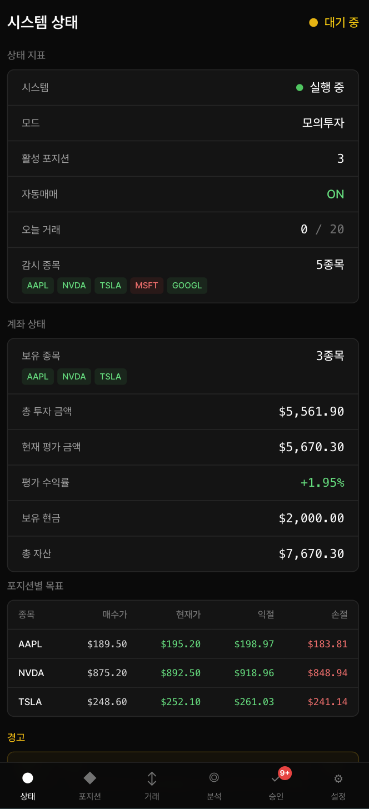
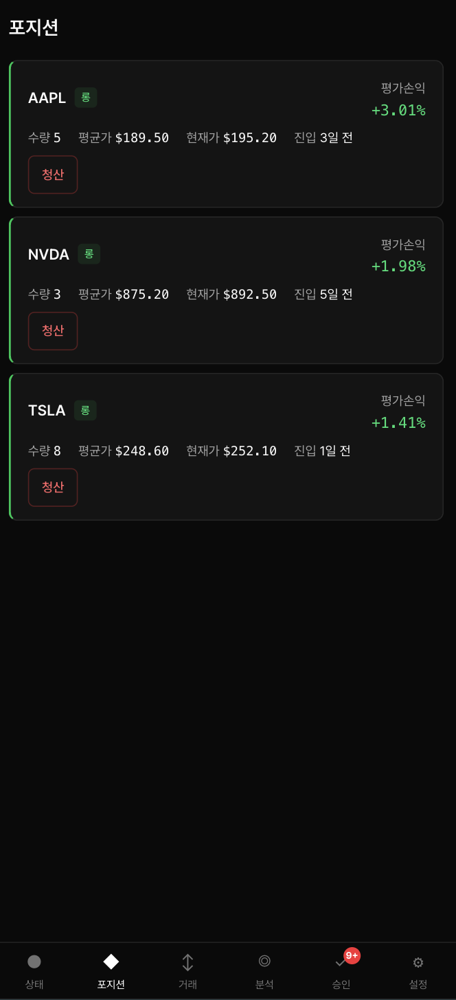
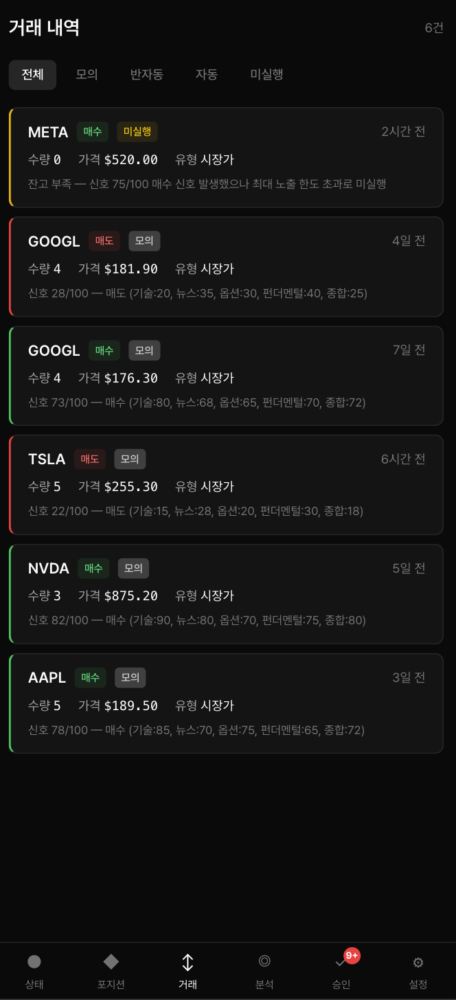
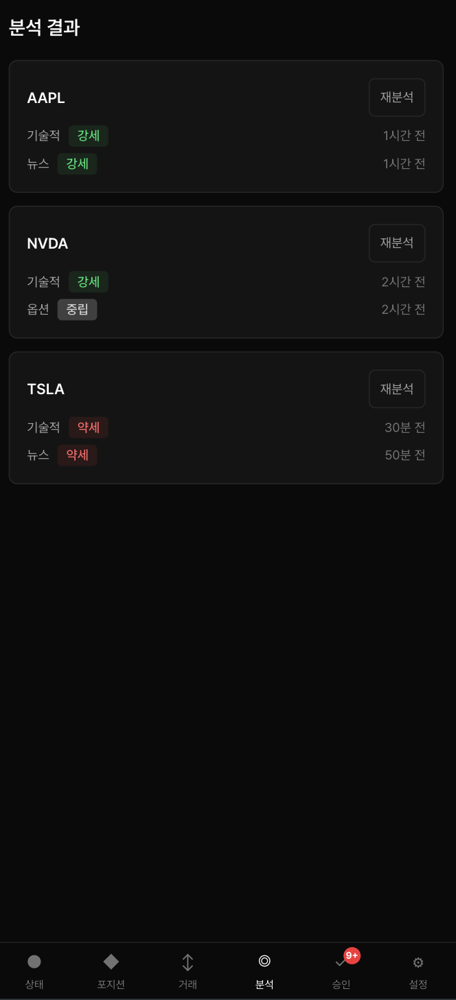
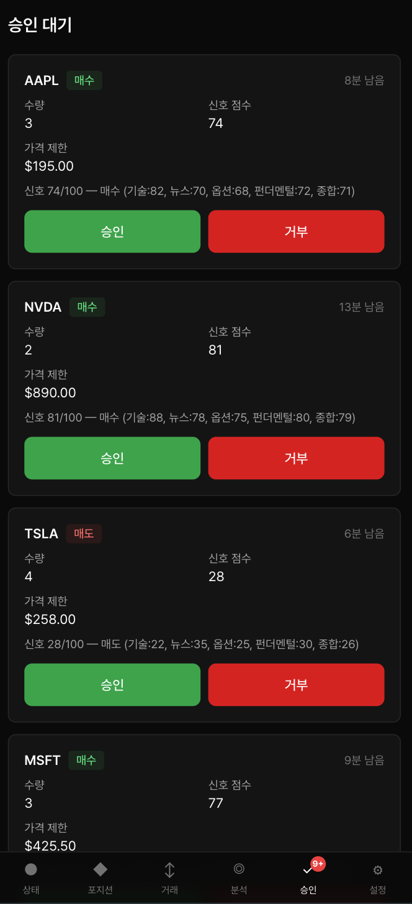
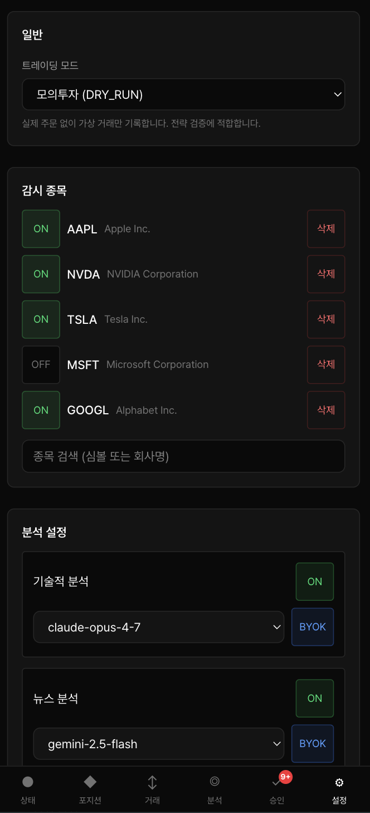

# siglens-trader

<div align="center">


## Siglens 분석 사이트 기반 작동

[](https://siglens.io)
[](https://github.com/y0ngha/siglens)


US 주식 자동매매 시스템. AI 분석 결과를 기반으로 매매 신호를 생성하고, 설정된 모드에 따라 자동으로 주문을 실행한다.

</div>

## 제품 화면

<p align="center">
  
  
  
  
  
  
</p>

## 문서

- [배포 가이드](docs/DEPLOYMENT.md) / [EC2 운영 런북](infra/aws/README.md)
- [보상 트랜잭션 설계](docs/COMPENSATING_TRANSACTIONS.md)
- 설계 문서: [AI 매매 게이트](docs/specs/2026-08-12-ai-trade-gate-design.md) · [지표 컨플루언스 축](docs/specs/2026-08-14-indicator-confluence-signal-design.md) · [진입 시간 창](docs/specs/2026-08-15-entry-window-design.md) · [매매 실행 주기](docs/specs/2026-08-16-execution-cadence-design.md) · [AWS 이전](docs/specs/2026-07-19-vercel-to-aws-migration-design.md)

## 동작 원리

```
[FMP / Yahoo Finance]  →  가격·바·뉴스·옵션·펀더멘털·의회공시 데이터 수집
         ↓
[siglens-core]         →  프롬프트 빌드 + LLM 직접 호출 (run*, 앱 프로세스 내부)
         ↓                 ※ 컨플루언스 축만 LLM 없이 지표 계산으로 판정
[strategy 모듈]        →  6축 점수화 → 매수/매도/보유 판단
         ↓
[AI 사이징 게이트]     →  주문 크기 결정 (분할 진입 / 분할 청산 비율)
         ↓
[Toss Securities API]  →  주문 실행 (auto 모드일 때만, 멱등성 키 + 주문 추적)
         ↓
[reconcile cron]       →  미체결 주문 타임아웃 + 자동 복구 + DB 정합성 검사 (10분 간격)
```

LLM 호출은 앱 프로세스 안에서 일어난다. 별도 worker 프로세스는 siglens-core 0.42에서 제거됐다.

### 분석 축

| 분석 | 데이터 소스 | LLM | 판단 근거 |
|------|------------|-----|-----------|
| 지표 컨플루언스 | FMP (OHLC 바) | ✗ | 강세 시그널 3종 이상 동시 성립 + 그중 1개 이상 신규 점등 + 종가 > SMA(50) |
| 기술적 분석 | FMP (가격/바) | ✓ | 추세, 리스크 레벨, 지지/저항, 보조지표 시그널 |
| 뉴스 분석 | FMP (뉴스) | ✓ | 시장 센티먼트, 이벤트 영향도 (기사별 카드 요약 후 종합) |
| 옵션 분석 | Yahoo Finance | ✓ | Put/Call 비율, OI 변화, IV 분석 |
| 펀더멘털 분석 | FMP (재무제표) | ✓ | 밸류에이션, 성장성, 재무건전성 |
| 의회 공시 분석 | FMP (의회 거래 공시) | ✓ | 의원 매수/매도 편향, 공시 지연 감안한 추세 |

분석 로직과 프롬프트 빌딩은 [`@y0ngha/siglens-core`](https://github.com/y0ngha/siglens-core)에서 관리한다. 축별 모델은 **설정 > 분석 설정**에서 개별 지정한다(기본 `deepseek-v4-flash`).

기술적 분석의 봉 주기는 대시보드 설정 `analysis_timeframe`으로 조정한다. 허용 값은 `15Min` / `30Min` / `1Hour`이며 기본값은 `1Hour`이다. execute cron은 이 주기에 맞춰 분석 신선도(staleness)를 판단한다 (15Min→45분, 30Min→90분, 1Hour→2시간).

### 신호 가중치

priority-weighted average. 기본 프로파일(`1Hour`)의 합은 38이지만, 가중 평균이므로 합 자체에는 의미가 없다.

| 축 | 15Min | 30Min | 1Hour (기본) |
|----|-------|-------|--------------|
| 컨플루언스 | 14 | 13 | **12** |
| 기술적 | 10 | 9 | 8 |
| 뉴스 | 6 | 6 | 6 |
| 옵션 | 6 | 5 | 5 |
| 펀더멘털 | 2 | 3 | 4 |
| 의회 공시 | 1 | 2 | 3 |

짧은 봉 주기일수록 가격 액션 쪽으로 무게가 옮겨간다. 매수 임계값 70 / 매도 임계값 30 (대시보드에서 조정). 저장된 `score_weights`가 프로파일을 키 단위로 덮어쓴다 — `score_weights.confluence = 0`이면 컨플루언스 축이 꺼진다(가중치 UI는 없고 `POST /api/config`가 유일한 경로).

컨플루언스 축의 규칙은 siglens 백테스트(2024.04–2026.04, 100건) 승률 70%인 조합을 그대로 옮긴 것이고, 같은 구간 LLM 승률 61.5%를 앞선 것이 가중치 12의 근거다. 세부 규칙:

- **조건부 투표** — 스냅샷이 없으면(FMP 장애, 121봉 미만) 가중치 0으로 분모에서 빠진다. FMP가 죽어도 이 축이 없던 때와 똑같이 동작한다.
- **트리거 하나로는 매수할 수 없다** — 나머지 5축이 전부 중립이면 63점(보유)에 그친다.
- **스냅샷 부재는 매수를 막는다** — 지표를 못 읽는 상황에서 문이 열리지 않도록, 스냅샷이 `null`이면 `buy` 판정을 `hold`로 강등한다. 매도는 건드리지 않는다.
- **매수는 막아도 매도는 못 막는다** — 축이 늘면 분모가 늘어 매도 임계값도 같이 올라가므로, 컨플루언스를 뺀 재계산에서 `sell`이면 `sell`을 유지한다.
- 역방향(약세 3종 + 종가 < MA50)은 **청산 트리거**로 쓰인다.

## AI 사이징 게이트

점수는 **살지 팔지**를 정하고, **얼마나**는 별도 LLM 호출(`lib/analysis/trade-gate.ts`)이 정한다. 이미 주문이 나가기로 결정된 경로에서만 호출되며, 0~1 사이 `fraction`을 돌려준다 — 진입이면 집행 가능 예산(종목 한도 ∩ 총노출 한도 ∩ 현금)의 비율, 청산이면 보유 수량의 비율.

- **모델**: `analysis_model_config['trade_gate']` — 다른 분석 축과 똑같이 설정에서 고른다.
- **진입은 fail-closed, 청산은 fail-open** — 놓친 매수는 기회 손실이지만 놓친 매도는 실현 손실이다. LLM 오류 시 진입은 주문 없이 이메일, 청산은 전량 청산.
- **고정 손절·시세 이상 같은 `hard` 청산은 게이트를 건너뛴다.** 리스크 통제는 절대적이고 목표가는 그렇지 않다.
- **게이트를 끄면** `fraction = 1`로 돌아간다(재배포 불필요). 단 진입 시 현금 클램프는 그대로 적용된다.
- **분할 진입은 체결 건수를 늘린다** — `auto` 전환 전에 `max_trades_per_day`를 확인할 것. 심볼당 실제 상한은 `entry_cooldown_min`(기본 60분)이 정한다.

## 매매 모드

| 모드 | 동작 |
|------|------|
| `dry_run` | 실제 주문 없음. 가상 거래만 DB에 기록. |
| `semi_auto` | 신호 발생 시 이메일 알림 → 대시보드에서 승인/거절 (대기 주문 TTL 15분) |
| `auto` | 즉시 주문 실행 |

모든 거래에는 AI의 판단 근거(reason)가 저장되어, 사용자가 매매 판단의 품질을 평가할 수 있다.

## 실행 주기와 진입 게이트

cron은 node-cron으로 **인프로세스** 실행된다(UTC 스케줄, `server/app.ts`의 `CRON_JOBS`). 정규장 밖 발사는 `isEtRegularSessionOpen` 게이트가 `market_closed`로 조기 반환한다. siglens-core 0.44부터 이 게이트는 **NYSE 휴장일과 13:00 반장까지 계산으로 판정**한다 — 추수감사절 정오나 조기 마감 후에는 dry_run을 포함한 모든 모드에서 장이 닫힌다.

| cron | 스케줄 (UTC) | 실효 주기 |
|------|-------------|-----------|
| technical / options | `*/15 13-21 * * 1-5` | `analysis_timeframe`을 따라감 (시계 창 기준) |
| news | `0 13-21 * * 1-5` | 60분 |
| fundamental | `0 15 * * 1-5` | 24시간 |
| congress | `0 16 * * 1-5` | 24시간 |
| execute | `2-59/5 13-21 * * 1-5` | `execute_interval_min` (5/10/15/20/30/60, 기본 **10분**) |
| reconcile | `*/10 13-21 * * 1-5` | 10분 (장 마감·휴장일에도 계속 — 주문 사후 처리는 장과 무관) |
| digest | `0 1 * * *` | 매일 (주말 포함) — quiet hours 큐 발송 + cron 이상 감지 |

분석 cron은 심볼을 **병렬로** 돌고(`Promise.all`), cadence는 경과 시간이 아니라 **시계 창**으로 강제한다. 한 심볼의 예외는 그 심볼만 `error`로 남고 나머지 결과를 버리지 않는다.

가격 조건(진입 구간, 손절선, 익절선)은 전부 execute 틱 안에서만 판정되므로 `execute_interval_min`이 곧 **반응 지연의 상한**이다.

### 진입 품질 가드

실행 주기를 좁혀도 **추격 매수**는 남기 때문에, 진입 쪽에만 별도 가드를 둔다. 전부 매수/추가매수만 막고 매도에는 걸지 않는다.

| 가드 | 설정 | 기본값 | 동작 |
|------|------|--------|------|
| 진입 구간 이탈 | — (분석 기반) | `entryPrices` 최댓값 +1% | 현재가가 권장 진입 구간 위면 건너뜀 (`entry_out_of_zone`). 상단만 본다 |
| 재진입 쿨다운 | `entry_cooldown_min` | 60분 | 마지막 **체결**(매수·매도 모두) 기준. 0이면 off |
| 진입 비권고 | — (분석 기반) | — | 분석의 `entryRecommendation`이 `avoid`면 점수와 무관하게 차단 |
| 같은 틱 부분 청산 | — | — | 같은 틱에 줄인 종목은 다시 늘리지 않음 |
| 진입 시간 창 | `entry_window` | ET 11:00–15:00 | 개장 갭·첫 30분 변동성·마감 임밸런스 회피. **ET 고정**(서머타임 대응) |

진입 시간 창은 cron 스케줄이 아니라 **게이트**다 — 창 밖에도 포지션 재평가·손절·청산·신호 매도는 정규장 내내 정상 동작한다.

## 안전 장치

| 장치 | 설명 |
|------|------|
| 킬 스위치 | `trading_enabled=false`로 **청산 포함 전부** 즉시 중단 (루프 중간에도 재확인) |
| 일일 거래 한도 | `max_trades_per_day`(기본 20) 초과 시 **신규 진입만** 차단 |
| 일일 손실 한도 | 실현 + 미실현 손실이 `max_daily_loss_usd`(기본 500) 초과 시 진입 차단 + 모든 청산을 전량으로 강제 + 이메일 |
| 종목별/총 노출 한도 | `max_position_size` / `max_total_exposure` — **원가(투자 금액) 기준**. 평가액 기준이면 가격이 내릴수록 예산이 커진다 |
| 분산 락 | Redis SETNX + UUID 소유자 검증 + Lua 스크립트 해제 (execute·analysis 락 TTL 30분) |
| 실행 데드라인 | execute 900초, 분석 cron 1200초, 심볼당 150초 — 플랫폼이 아니라 코드가 정한 상한 |
| 멱등성 키 | `{cronRunId}-{symbol}-{side}` 형식으로 중복 주문 방지 |
| 주문 추적 | `order_tracking` 테이블로 submitted → filled/rejected/timeout 전체 라이프사이클 관리 |
| 정합성 검사 | reconcile cron이 10분마다 미체결 타임아웃(30분) + 자동 복구 + DB 일관성 확인 |
| cron 감사 로그 | `cron_runs` / `cron_decisions`에 실행·판단 근거 기록. 15분 넘게 `running`인 행은 다음 실행이 `error`로 마감 |
| cron 이상 감지 | digest cron이 24시간 내 실패 / 72시간 침묵을 감지해 알림 (정상이면 침묵) |
| 손절 쿨다운 | 같은 cron 실행 내에서 손절 후 즉시 재매수 방지 |
| 매도 중복 방지 | 이미 submitted 상태인 매도 주문이 있는 종목은 추가 매도 차단 |
| DB 트랜잭션 | 거래+포지션 변경은 반드시 트랜잭션 내에서 원자적으로 실행 |
| NaN 방어 | `isFinitePositive`, `safeNumber`, `safe-extract` 모듈로 AI 결과의 NaN/Infinity 전파 차단 |
| 부분 체결 | `reducePositionQuantity`로 부분 매도 시 포지션 수량만 감소 |

**리스크 차단기는 새 리스크만 막고, 리스크 축소는 절대 막지 않는다.** 킬 스위치만 예외로 전부를 멈춘다.

## 알림

Resend로 이메일 발송. **00:00–09:59 KST(quiet hours)** 사이에 발생한 알림은 `notification_queue`에 쌓였다가 digest cron이 10:00 KST에 한 통으로 보낸다. 이벤트별 on/off는 **설정 > 알림**에서 조정한다(거래 체결, 주문 승인 대기, 손절 발동, 시스템 오류, 시스템 이상 감지). 채널이나 이벤트가 꺼져 있으면 큐에도 쌓이지 않는다.

## 인증

자체 로그인이 기본 경로다. `POST /api/auth/login`이 bcrypt(cost 12)로 비밀번호를 검증하고 `trader_session` HttpOnly 쿠키를 발급한다. **가입 엔드포인트는 없다** — 계정은 `yarn db:seed-operator`로만 만든다.

Cloudflare Access JWT(`CF_ACCESS_TEAM_DOMAIN` + `CF_ACCESS_AUD`)도 병행 지원한다. 헤더만 믿는 폴백은 없다 — Access를 걷어내면 오리진이 직접 노출되므로 위조 헤더가 곧 인증 우회다. 로컬 개발은 `DISABLE_AUTH=true`(프로덕션에서는 무시).

## 기술 스택

- **Frontend**: React 19 + Vite (PWA), TanStack Query, Tailwind CSS v4
- **Backend**: Hono (Node) on AWS EC2 — 정적 SPA + `/api` 라우트 + 인프로세스 node-cron, Docker/ECR 배포
- **DB**: Neon PostgreSQL + Drizzle ORM (15 테이블)
- **분석**: [@y0ngha/siglens-core](https://github.com/y0ngha/siglens-core) `0.47.0` (LLM 호출은 앱 프로세스 내부)
- **데이터**: FMP API, Yahoo Finance (yahoo-finance2)
- **인증**: 자체 로그인 (bcrypt + 세션 쿠키, 회원가입 없음) — Cloudflare Access JWT도 병행 지원
- **알림**: Resend (Email)
- **락**: Upstash Redis (distributed lock, SETNX + Lua release)
- **테스트**: Vitest + MSW (Mock Service Worker), 2036개 테스트
- **패키지 매니저**: Yarn 4

## 필요한 외부 서비스

| 서비스 | 용도 | 비고 |
|--------|------|------|
| FMP API | 가격·바·뉴스·펀더멘털·의회공시 | [financialmodelingprep.com](https://financialmodelingprep.com) |
| Yahoo Finance | 옵션 체인 데이터 | yahoo-finance2 npm 패키지 |
| LLM 제공사 | 분석 + 사이징 게이트 | DeepSeek / Anthropic / Google / OpenAI — 설정한 모델의 키만 있으면 된다 |
| Upstash Redis | 분산 락 + 토스 OAuth 토큰·accountSeq 캐시 + core 내부 캐시 | |
| Neon DB | 상태/이력 저장 | PostgreSQL |
| Toss Securities | 주문 실행 | Open API (OAuth2 client_credentials, 개인용) |
| Resend | 이메일 알림 | |
| Cloudflare | DNS + Access 인증 + Tunnel(유일한 인그레스) | |
| GitHub Packages | `@y0ngha/siglens-core` 설치 | `read:packages` 토큰 필요 (`SIGLENS_GITHUB_TOKEN`) |

## 실행

`@y0ngha/siglens-core`는 GitHub Packages에서 받으므로, `yarn install` 전에 `SIGLENS_GITHUB_TOKEN`(`read:packages` 스코프)이 환경에 있어야 한다 — `.yarnrc.yml`이 이 값을 읽는다.

```bash
# 의존성 설치
yarn install

# 개발 서버 (대시보드)
yarn dev              # 포트 6270
yarn dev:mock         # MSW mock 모드 — 백엔드 없이 UI 개발

# 서버 (Hono + cron) — 컨테이너가 실제로 돌리는 것
yarn start

# 빌드 / 타입 / 린트
yarn build
yarn typecheck
yarn lint          # lint:fix, lint:style, lint:style-fix

# 테스트
yarn test          # test:watch, test:coverage

# 포맷
yarn format        # format:check

# DB
yarn db:generate       # 스키마 변경 → 마이그레이션 생성
yarn db:migrate        # 마이그레이션 실행
yarn db:seed-operator  # 운영자 계정 생성 (유일한 계정 생성 경로)
yarn db:seed           # Mock 데이터 삽입
yarn db:clear          # 전체 데이터 삭제 (확인 프롬프트 있음)

# 릴리스 = 배포 트리거 (v* 태그 푸시가 .github/workflows/deploy.yml 실행)
yarn release --ci
```

## 환경변수

`.env.example` 참고. 주요 항목:

```
DISABLE_AUTH=          # true면 로컬에서 로그인 없이 개발 (프로덕션에서는 무시)
OPERATOR_EMAIL=        # yarn db:seed-operator 전용 — 운영자 계정 생성/비밀번호 회전
OPERATOR_PASSWORD=
CF_ACCESS_TEAM_DOMAIN= # Cloudflare Access JWT 검증 (선택)
CF_ACCESS_AUD=
DATABASE_URL=          # Neon PostgreSQL
UPSTASH_REDIS_REST_URL= # 토스 OAuth 토큰 캐시 + accountSeq 캐시 + 분산 락 (trading 필수)
UPSTASH_REDIS_REST_TOKEN=
FMP_API_KEY=           # 시장 데이터
MARKET_DATA_PROVIDER=fmp
DEEPSEEK_API_KEY=      # 기본 분석 모델 + 뉴스 카드 요약
ANTHROPIC_API_KEY=     # 설정한 모델의 키만 있으면 된다
GEMINI_API_KEY=
OPENAI_API_KEY=
TOSS_APP_KEY=          # 토스증권 OAuth2 client_id (auto/semi_auto 필수)
TOSS_SECRET_KEY=       # 토스증권 OAuth2 client_secret
CRON_SECRET=           # cron 인증 (미설정 시 스케줄러 비활성)
RESEND_API_KEY=        # 이메일 알림
NOTIFICATION_EMAIL_FROM=noreply@siglens.io
TUNNEL_TOKEN=          # Cloudflare Tunnel (AWS 배포 전용, 인스턴스의 유일한 인그레스)
SIGLENS_GITHUB_TOKEN=  # GitHub Packages read:packages — yarn install에 필요
```

## 라이선스

MITLicense

## 면책 고지

본 서비스는 Siglens의 분석 결과를 바탕으로 이용자가 설정한 값에 따라 자동 매매를 진행하는 서비스입니다. 모든 투자 판단, 설정값 구성, 자동 매매 실행 및 그 결과에 대한 책임은 이용자 본인에게 있으며, Siglens 및 Siglens Trader는 투자 손실이나 기타 불이익에 대해 책임을 지지 않습니다.
